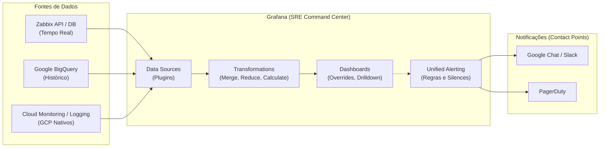

# ☁️ Módulo 4: Trabalhando com diferentes métricas no Grafana

**Duração:** 04:00h | **Instrutor:** Felipe | **Nível:** Avançado

### 📚 Conteúdo Programático
*   Grafana + Zabbix
*   Grafana + Google BigQuery
*   Transformations
*   Overrides
*   Drilldown
*   Alerting
*   Criação de Dashboard
*   Laboratório Prático

---

Este repositório contém o guia prático do módulo final, focado em consolidar múltiplas fontes de dados (Zabbix, BigQuery e nativos da GCP) no **Grafana**. Aprenderemos a transformar e correlacionar métricas, aplicar estilos condicionais, criar navegações contextuais (Drilldown) e configurar alertas unificados.

---

## 🏗️ Arquitetura da Solução (SRE Command Center)

O Grafana atua como o painel central (Single Pane of Glass). Ele consulta dados em tempo real do Zabbix e dados históricos do BigQuery, aplicando transformações em memória. A engine de alertas avalia essas métricas e roteia incidentes para as ferramentas de comunicação da equipe.



---

## 🛠️ Laboratório Prático: Passo a Passo

### 1. Instalação de Plugins no Grafana
Para conectar o Zabbix e o BigQuery, precisamos instalar os plugins específicos e reiniciar o Grafana.

```bash
# Instalar plugin do Zabbix (Alexander Zobnin)
grafana-cli plugins install alexanderzobnin-zabbix-app

# Instalar plugin do BigQuery (DoIT International)
grafana-cli plugins install doitintl-bigquery-datasource

# Reiniciar o serviço do Grafana para carregar os plugins
sudo systemctl restart grafana-server
```

---

### 2. Configurando Data Sources
Acesse a interface do Grafana (`Connections` > `Data Sources`).

**A. Zabbix**
*   **URL:** `http://zabbix-server/api_jsonrpc.php`
*   **Username / Password:** Utilize um usuário *Read-Only*.
*   ⚡ **Performance (Direct DB Connection):** Habilite a conexão direta com o banco (MySQL/PostgreSQL) para reduzir a latência de consultas pesadas de segundos para milissegundos.

**B. Google BigQuery**
*   **Authentication:** `Google JWT File` (Faça upload do JSON da sua Service Account).
*   **Default Project:** O ID do seu projeto GCP.
*   **Processing Location:** `US` (ou a região do seu Dataset).

---

### 3. Painel Integrado (Transformations)
Vamos unir dados de CPU em tempo real (Zabbix) com a média histórica (BigQuery) no mesmo gráfico.

1.  Crie um painel do tipo **Time series**.
2.  **Query A (Zabbix):** Busque a métrica `system.cpu.util[,idle]` do grupo `Linux Servers`.
3.  **Query B (BigQuery - SQL):**
    ```sql
    SELECT
      TIMESTAMP_TRUNC(timestamp, MINUTE) AS time,
      host_name AS metric,
      AVG(value) AS value
    FROM `zabbix_metrics.history`
    WHERE item_key = "system.cpu.util[,idle]"
      AND $__timeFilter(timestamp)
    GROUP BY time, metric
    ORDER BY time
    ```
4.  Vá na aba **Transform** e adicione a regra **Merge**. O Grafana unirá as duas consultas em uma única linha do tempo consolidada.

---

### 4. Navegação Contextual (Drilldown com Data Links)
Crie links dinâmicos para navegar de uma visão geral para detalhes de um servidor específico.

1.  Em um painel de Tabela (Overview de Hosts), vá em **Panel options** > **Data Links** > **Add link**.
2.  **Title:** `Ver detalhes do host`
3.  **URL:** `/d/host-detail/host-detail?var-hostname=${__data.fields.hostname}&from=${__from}&to=${__to}`
> *Isso passa o nome do host clicado e o intervalo de tempo (`__from` e `__to`) para o dashboard de destino.*

---

### 5. Unified Alerting (Roteamento Inteligente)
Configure alertas para monitorar o ambiente e enviar notificações.

**1. Criar Contact Point (Google Chat/Webhook):**
*   Vá em `Alerting` > `Contact Points` > `New`.
*   **Type:** `Webhook` / `Google Chat`.
*   **URL:** `https://chat.googleapis.com/v1/spaces/...`

**2. Notification Policies (Roteamento):**
*   Crie uma rota para que alertas com a label `severity=critical` sejam enviados para o Google Chat + PagerDuty, enquanto alertas menores vão para um canal de avisos.

---

### 6. Dashboard as Code (Exportação via API)
Após criar seu "SRE Command Center" com as Rows, Overrides e Variáveis, você deve versioná-lo em JSON.

```bash
# Exportar o dashboard atual para um arquivo JSON
curl -s -X GET "http://localhost:3000/api/dashboards/uid/UID_DO_DASHBOARD" \
  -H "Authorization: Bearer SEU_API_TOKEN" | jq '.dashboard' > sre-command-center.json

# Importar/Atualizar um dashboard via API (Deploy)
curl -s -X POST "http://localhost:3000/api/dashboards/db" \
  -H "Content-Type: application/json" \
  -H "Authorization: Bearer SEU_API_TOKEN" \
  -d @sre-command-center.json
```

## 💡 Dicas de Ouro
*   **Overrides:** Use *Field Overrides* com Regex (ex: `.*error.*`) para pintar de vermelho colunas críticas, mantendo o padrão verde para o resto da tabela.
*   **Silences:** Vai fazer manutenção? Use a aba *Silences* no menu de Alerting para pausar os alertas de um servidor específico (`host = web-server-01`) durante a janela de mudança, evitando spam na madrugada.
